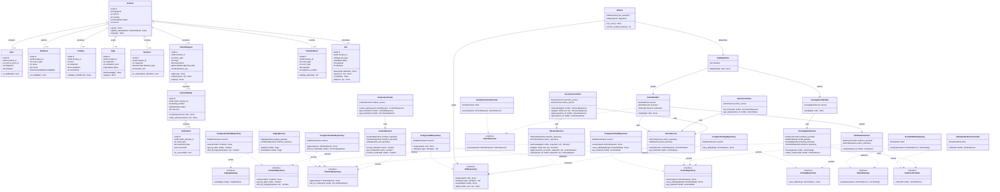

# LLD UML Class Diagram

```mermaid
classDiagram
    direction TB

    class Incident {
        -UUID id
        -str fingerprint
        -str service
        -str severity
        -IncidentStatus status
        -int version
        +open() None
        +update_status(status: IncidentStatus) None
        +resolve() None
    }
    class Alert {
        -UUID id
        -UUID incident_id
        -str source_event_id
        -str fingerprint
        -dict payload
        +is_duplicate() bool
    }
    class Evidence {
        -UUID id
        -UUID incident_id
        -str source_type
        -str query
        -dict result
        -EvidenceAvailability availability
        +is_available() bool
    }
    class Finding {
        -UUID id
        -UUID incident_id
        -str kind
        -str statement
        -float confidence
        -str uncertainty
        +validate_confidence() None
    }
    class Page {
        -UUID id
        -UUID incident_id
        -str responder
        -int escalation_level
        -PageStatus status
        +acknowledge() None
        +expire() None
    }
    class Decision {
        -UUID id
        -UUID incident_id
        -str responder
        -DecisionType decision_type
        -str decision_text
        +is_expired(now: datetime) bool
    }
    class ActionRequest {
        -UUID id
        -UUID incident_id
        -str action_type
        -str target
        -dict parameters
        -ApprovalState approval_state
        -str idempotency_key
        +approve() None
        +reject(reason: str) None
        +expire() None
    }
    class ActionAttempt {
        -UUID id
        -UUID action_request_id
        -int attempt_number
        -AttemptStatus status
        -dict outcome
        +complete(outcome: dict) None
        +mark_unknown(reason: str) None
    }
    class Verification {
        -UUID id
        -UUID action_attempt_id
        -str check_type
        -dict observed_state
        -bool successful
        +is_successful() bool
    }
    class TimelineEvent {
        -UUID id
        -UUID incident_id
        -str event_type
        -str actor_type
        -dict payload
        -int sequence_number
        +display_payload() dict
    }
    class Job {
        -UUID id
        -UUID incident_id
        -JobType job_type
        -JobStatus status
        -dict payload
        -int attempts
        +lease(until: datetime) None
        +retry(error: str) None
        +complete() None
        +fail(error: str) None
    }

    class IncidentController {
        -IncidentService incident_service
        +create_alert(request: AlertRequest) IncidentResponse
        +get_incident(id: UUID) IncidentResponse
        +get_timeline(id: UUID) list~TimelineEvent~
    }
    class DecisionController {
        -DecisionService decision_service
        -ActionService action_service
        +acknowledge(id: UUID) DecisionResponse
        +reply(id: UUID, text: str) DecisionResponse
        +approve(action_id: UUID) ActionResponse
        +reject(action_id: UUID) ActionResponse
    }
    class ActionController {
        -ActionService action_service
        +list_actions(id: UUID) list~ActionRequest~
        +get_status(action_id: UUID) ActionStatus
    }
    class IncidentService {
        -IncidentRepository incident_repository
        -TimelineRepository timeline_repository
        -JobRepository job_repository
        +accept_alert(alert: Alert) Incident
        +get_incident(id: UUID) Incident
        +resolve_incident(id: UUID) Incident
    }
    class InvestigationService {
        -EvidenceProvider evidence_provider
        -ModelGateway model_gateway
        -FindingRepository finding_repository
        -TimelineRepository timeline_repository
        +investigate(id: UUID) list~Finding~
        +collect_evidence(id: UUID) list~Evidence~
    }
    class PagingService {
        -PagingGateway paging_gateway
        -TimelineRepository timeline_repository
        +page(id: UUID) Page
        +escalate(id: UUID) Page
    }
    class DecisionService {
        -TimelineRepository timeline_repository
        -ActionRepository action_repository
        +acknowledge(id: UUID, responder: str) Decision
        +reply(id: UUID, text: str) Decision
        +approve(action_id: UUID, responder: str) ActionRequest
        +reject(action_id: UUID, responder: str) ActionRequest
    }
    class ActionService {
        -ActionRepository action_repository
        -JobRepository job_repository
        +request(action: ActionRequest) ActionRequest
        +get_status(id: UUID) ActionStatus
    }
    class VerificationService {
        -EvidenceProvider evidence_provider
        -ActionRepository action_repository
        +verify(attempt_id: UUID) Verification
    }

    class IncidentRepository {
        <<interface>>
        +save(incident: Incident) None
        +get_by_id(id: UUID) Incident
        +find_by_fingerprint(value: str) Incident
    }
    class EvidenceProvider {
        <<interface>>
        +collect(id: UUID) list~Evidence~
    }
    class ModelGateway {
        <<interface>>
        +analyze(evidence: list~Evidence~) list~Finding~
    }
    class FindingRepository {
        <<interface>>
        +save_all(findings: list~Finding~) None
    }
    class ActionRepository {
        <<interface>>
        +save(request: ActionRequest) None
        +save_attempt(attempt: ActionAttempt) None
        +get_status(id: UUID) ActionStatus
    }
    class JobRepository {
        <<interface>>
        +enqueue(job: Job) None
        +claim(job_type: JobType) Job
        +complete(id: UUID) None
        +fail(id: UUID, error: str) None
    }
    class TimelineRepository {
        <<interface>>
        +append(event: TimelineEvent) None
        +list_for_incident(id: UUID) list~TimelineEvent~
    }
    class PagingGateway {
        <<interface>>
        +send(page: Page) PageDelivery
    }
    class ActionExecutor {
        <<interface>>
        +execute(action: ActionRequest) ActionOutcome
    }

    class Worker {
        -JobRepository job_repository
        -JobDispatcher dispatcher
        +run_once() None
        +recover_expired_leases() int
    }
    class JobDispatcher {
        -dict handlers
        +dispatch(job: Job) None
    }
    class InvestigationHandler {
        -InvestigationService service
        +handle(job: Job) None
    }
    class ActionHandler {
        -ActionService service
        -ActionExecutor executor
        -VerificationService verification
        +handle(job: Job) None
    }
    class PostgresIncidentRepository {
        -DatabaseSession session
        +save(incident: Incident) None
        +get_by_id(id: UUID) Incident
        +find_by_fingerprint(value: str) Incident
    }
    class PostgresFindingRepository {
        -DatabaseSession session
        +save_all(findings: list~Finding~) None
    }
    class PostgresActionRepository {
        -DatabaseSession session
        +save(request: ActionRequest) None
        +save_attempt(attempt: ActionAttempt) None
        +get_status(id: UUID) ActionStatus
    }
    class PostgresJobRepository {
        -DatabaseSession session
        +enqueue(job: Job) None
        +claim(job_type: JobType) Job
    }
    class PostgresTimelineRepository {
        -DatabaseSession session
        +append(event: TimelineEvent) None
        +list_for_incident(id: UUID) list~TimelineEvent~
    }
    class SimulatorEvidenceProvider {
        -SimulatorClient client
        +collect(id: UUID) list~Evidence~
    }
    class ProviderModelGateway {
        -ModelClient client
        +analyze(evidence: list~Evidence~) list~Finding~
    }
    class SimulatorActionExecutor {
        -SimulatorClient client
        +execute(action: ActionRequest) ActionOutcome
    }

    Incident "1" o-- "many" Alert : contains
    Incident "1" o-- "many" Evidence : gathers
    Incident "1" o-- "many" Finding : produces
    Incident "1" o-- "many" Page : sends
    Incident "1" o-- "many" Decision : receives
    Incident "1" o-- "many" ActionRequest : proposes
    ActionRequest "1" o-- "many" ActionAttempt : executes
    ActionAttempt "1" o-- "many" Verification : confirms
    Incident "1" o-- "many" TimelineEvent : records
    Incident "1" o-- "many" Job : schedules

    IncidentController --> IncidentService : calls
    DecisionController --> DecisionService : calls
    DecisionController --> ActionService : calls
    ActionController --> ActionService : calls
    IncidentService ..> IncidentRepository : persists
    IncidentService ..> TimelineRepository : records
    IncidentService ..> JobRepository : enqueues
    InvestigationService ..> EvidenceProvider : reads
    InvestigationService ..> ModelGateway : analyzes
    InvestigationService ..> FindingRepository : persists
    InvestigationService ..> TimelineRepository : records
    PagingService ..> PagingGateway : sends
    PagingService ..> TimelineRepository : records
    DecisionService ..> ActionRepository : persists
    DecisionService ..> TimelineRepository : records
    ActionService ..> ActionRepository : persists
    ActionService ..> JobRepository : enqueues
    VerificationService ..> EvidenceProvider : checks
    VerificationService ..> ActionRepository : persists
    Worker --> JobRepository : claims
    Worker --> JobDispatcher : dispatches
    JobDispatcher --> InvestigationHandler : selects
    JobDispatcher --> ActionHandler : selects
    InvestigationHandler --> InvestigationService : calls
    ActionHandler --> ActionService : calls
    ActionHandler ..> ActionExecutor : executes
    ActionHandler --> VerificationService : verifies
    PostgresIncidentRepository ..|> IncidentRepository
    PostgresFindingRepository ..|> FindingRepository
    PostgresActionRepository ..|> ActionRepository
    PostgresJobRepository ..|> JobRepository
    PostgresTimelineRepository ..|> TimelineRepository
    SimulatorEvidenceProvider ..|> EvidenceProvider
    ProviderModelGateway ..|> ModelGateway
    SimulatorActionExecutor ..|> ActionExecutor
```
